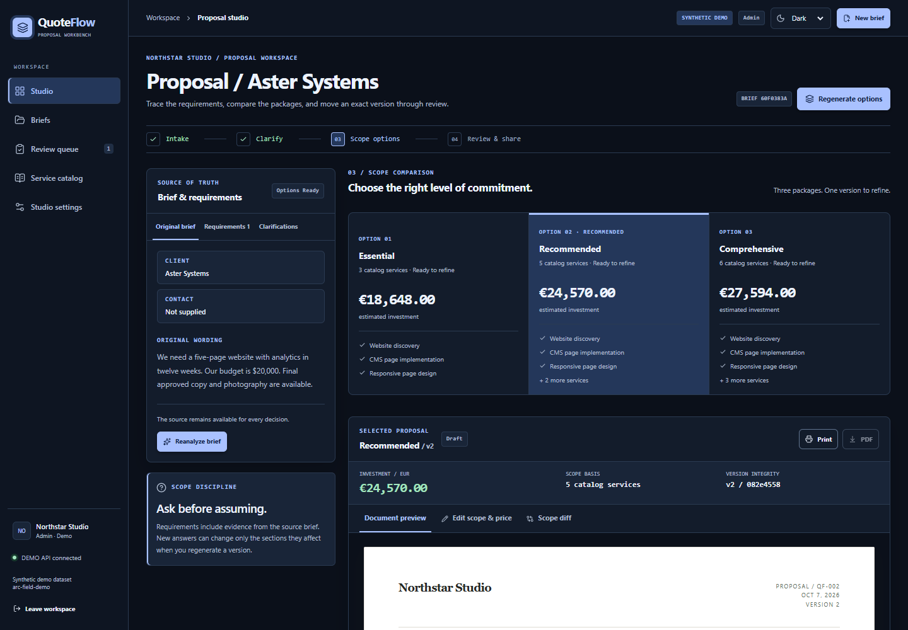

# QuoteFlow

> From client brief to approved proposal and project handoff.



[Getting started](#getting-started) · [Architecture](docs/ARCHITECTURE.md) · [Evaluation](docs/EVALUATION.md) · [Security](docs/SECURITY.md)

## Overview

QuoteFlow is a self-hostable proposal and quotation studio for the fictional **Arc & Field Studio**. It turns a client brief into evidence-backed requirements, clarification questions, three catalog-priced options, an internally approved proposal, a customer review page, and a project handoff. The local demonstration uses a **synthetic demo dataset** and records notifications in a local outbox.

### Core workflow

**Brief → clarification → priced options → approval → PDF → acceptance → handoff**

### Capabilities

- Evidence-backed brief intake and clarifications
- Deterministic catalog pricing with approval gates
- Versioned proposals, customer review and PDF output

### Technology

FastAPI · React · LangGraph · PostgreSQL

### Evidence and scope

49 backend tests and local browser journeys passed for the October workbench rollout. The newest source has not been revalidated on Docker after a host storage failure. The included demo uses synthetic data and local simulators. Deployment and live-provider limits are documented in [implementation status](docs/IMPLEMENTATION_STATUS.md).

## Getting started

Run the local demonstration from the repository root using the project-specific instructions below. External service credentials are needed only for connected integrations.

### Quick start

Prerequisites: Docker Engine with Compose and enough disk space for PostgreSQL, Python, and the web image. The POSIX readiness script uses `curl`.

```powershell
# Windows PowerShell, from this directory
Copy-Item .env.example .env
docker compose up --build -d
```

```sh
# POSIX shell, from this directory
cp .env.example .env
docker compose up --build -d
```

Open [http://localhost:8080](http://localhost:8080). The demo sign-in lets you choose the seeded demo workspace and role; it never requires or exposes a live customer account. The API health endpoint is at [http://localhost:8080/api/health](http://localhost:8080/api/health). To stop, run `docker compose down`; the PostgreSQL and proposal-asset volumes remain. `docker compose down -v` deletes those local volumes and should only be used when an explicit demo reset is intended.

If port 8080 is occupied, set `QUOTEFLOW_PORT` to a free port in `.env` or in your shell before launch. The public and API URLs follow that port unless explicitly overridden.

For a readiness check as part of the launch command, use `./scripts/start-demo.ps1` in PowerShell or `sh scripts/start-demo.sh` on POSIX.

The API image generates the full reproducible dataset and runs `python -m quoteflow.cli init-demo --full` before starting. Source data are generated with a fixed seed and reference date by `scripts/generate_demo.py`. The database contains two separated synthetic workspaces for access-boundary checks. See [DATA_CARD.md](docs/DATA_CARD.md) for counts and limitations.

## Local development

Backend and frontend can run separately when Docker is unavailable. Set `DATABASE_URL` to a local PostgreSQL instance for the intended stack. The backend also accepts SQLite for a temporary development session; this does not verify PostgreSQL migrations or checkpoints.

```powershell
# Windows PowerShell
uv sync --project apps/api --all-extras
uv run --project apps/api python scripts/generate_demo.py --output data/generated
uv run --project apps/api python -m quoteflow.cli init-demo --full
uv run --project apps/api uvicorn quoteflow.main:app --reload --port 8000 --no-access-log
```

```sh
# POSIX shell
uv sync --project apps/api --all-extras
uv run --project apps/api python scripts/generate_demo.py --output data/generated
uv run --project apps/api python -m quoteflow.cli init-demo --full
uv run --project apps/api uvicorn quoteflow.main:app --reload --port 8000 --no-access-log
```

In another terminal, run `cd apps/web && corepack pnpm install --frozen-lockfile && corepack pnpm dev`. Vite proxies `/api` to the backend. Never put model or HubSpot credentials in the browser environment. `MODE=CONNECTED` requires explicitly configured provider credentials; a failed live request is an error, not a simulated result.

With the API on port 8000 and Vite on port 5173, run the reproducible browser journey from `apps/web` with `pnpm exec playwright install chromium` once, then `pnpm test:browser`. Set `QUOTEFLOW_URL` for another web port or `QUOTEFLOW_BROWSER=msedge` to use installed Edge. Its screenshots go to ignored `tmp/browser-check` so the eight selected portfolio captures stay unchanged.

## Verification and handover

API contracts, architecture, operation, security, evaluation, deployment prerequisites, and honest completion status are in [docs](docs). Run the test commands in [HANDOVER.md](docs/HANDOVER.md) before using this as a customer pilot. No synthetic quality result should be presented as real-customer accuracy, and customer acceptance here is a workflow acknowledgement rather than a certified electronic signature.


## Proposal workbench and appearance

The compact workbench places brief evidence, catalog-priced options, selected version and scope editor together. Light/Dark/System preserve drafts and prices; the customer document retains its fixed printable palette. Read [the current workbench report](docs/WORKBENCH_2026-10-07.md), [client setup](docs/CLIENT_SETUP.md) and [synthetic screenshots/PDF evidence](docs/evidence/redesign-2026-10-07/README.md) for configuration, verification and remaining integration/font limits.
