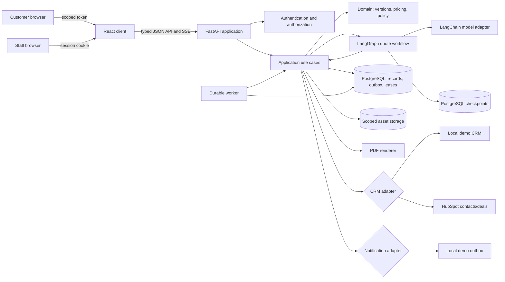
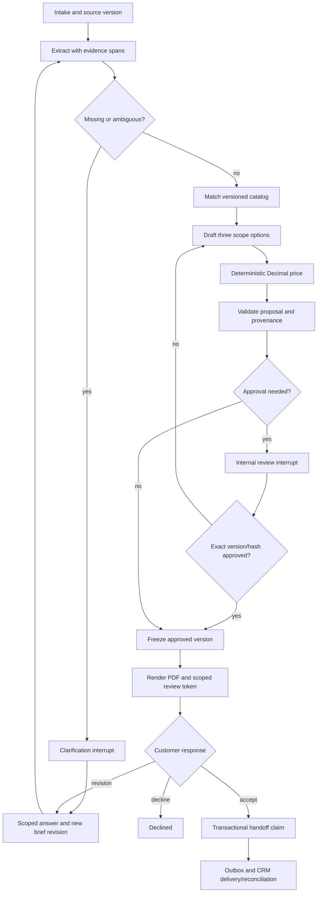
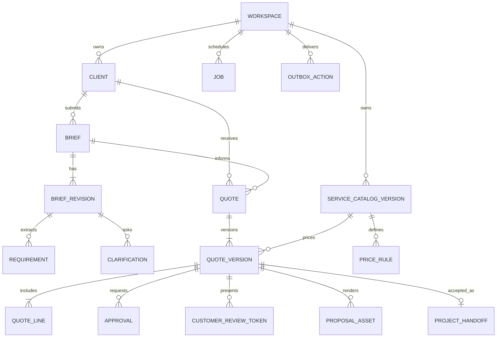

# Architecture

This is the v1 architectural contract. The checked-in modules, adapters and persistence must be compared with this diagram before a deployment claim; implementation status is in [`IMPLEMENTATION_STATUS.md`](IMPLEMENTATION_STATUS.md).

## Runtime boundaries

The API validates inputs and authorizes workspace/role access before use cases. Pure domain functions enforce quote arithmetic and state transitions. External model, storage, CRM and notification boundaries have small replaceable interfaces. The graph coordinates the known stages; it does not own final price calculation. A durable worker claims persisted jobs so a process restart can recover abandoned work; checkpoints alone are insufficient to schedule them.

## Workflow

The graph needs a bounded loop/step count, run budget and timeouts. Workflow thread/run IDs are server-issued and scoped; knowing an ID never grants access. Large PDFs and uploads stay in scoped storage and are referenced in graph state by ID. Approval is recorded separately from external effects; execution rechecks authorization, quote state, version and hash. Re-entered graph nodes may repeat pre-interrupt code, so local writes use unique keys/transactional claims. Uncertain remote outcomes require reconciliation before retry; there is no generic exactly-once guarantee across third-party APIs.

## Data relationships

Key invariants: every owned record is workspace scoped; a quote version references an immutable catalog version and all price inputs; its content hash covers approval-sensitive scope and price fields; accepted versions are immutable; a token binds one client, quote version, purpose and expiry; one accepted version can yield at most one handoff. Source spans and extraction status are stored with each requirement. Outbox action keys and provider idempotency keys make local retries safe.

## Change and regeneration

A new customer clarification creates a `BriefRevision`. The application identifies affected requirements and derives a new `QuoteVersion`, leaving the old version and any PDF intact. A scope diff compares line additions/removals/quantity/rate and text sections. If the content hash changes, earlier approval and customer review links are no longer usable for acceptance. The operator reviews regenerated sections before release.

## Deployment shape

The Compose file runs web client, API, a persistent `python -m quoteflow.cli run-worker` process and PostgreSQL 17.10. The worker starts after API health, initializes its checkpoint setup once, then uses a fresh DB session per cycle with default `WORKER_POLL_SECONDS=10`, sleeping while idle and reconnecting after an error. Compose rebuild/start, API health and the web endpoint passed on 2026-09-28. Migration `a4b1c9d2e3f4` widened `jobs.status` to `VARCHAR(64)` after an initial live truncation; a PostgreSQL workflow then resumed after API restart through customer acceptance with 16 checkpoints and one handoff. A separate manually expired running lease was recovered within a poll by the rebuilt worker to clarification and later cancelled; this does not establish actual process-crash or concurrent-worker behavior. Worker CPU snapshots were 0.00% idle and 0.31%/about 99 MiB after recovery, compared with one transient 99.38% single-core sample from the previous short-process loop; these samples are not a sustained benchmark. Assets use a workspace-scoped local volume for the pilot; a cloud object store would require its own adapter and threat review. A custom-format PostgreSQL dump restored matching database rows/checkpoints to a disposable separate DB; separately, three synthetic PDFs in the API volume matched byte-for-byte after tar/extraction to another directory. A coordinated database-plus-volume restore in a separate installation and backup encryption remain unverified. Back up the database, checkpoints and asset volume together for a customer installation.
